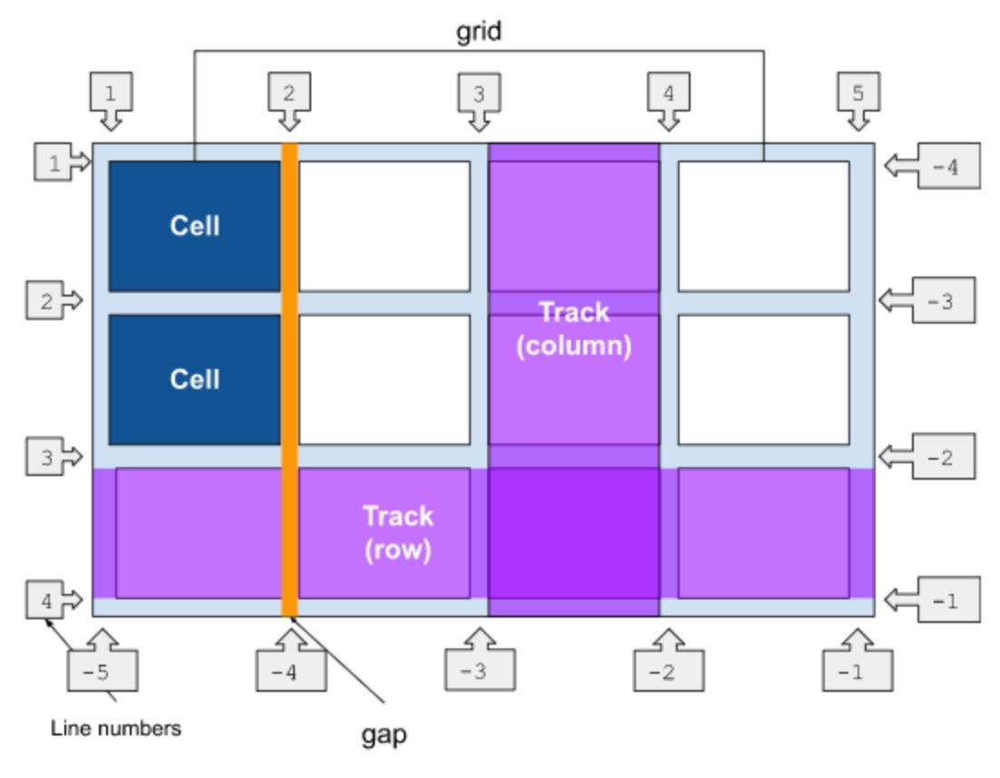

# The Box Model


- The content may overflow out of the box.
- Usually the size refers to the content box by default (`box-sizing: content-box;`), unless it's set to `box-sizing: border-box;`
- Browsers have their own user agent stylesheets, but they can be reset with reset and normalizer css files with (arguably) more sensible defaults.
E.g. to use the `border-box` sizing model,
```css
html {
  box-sizing: border-box;
}
*,
*::before,
*::after {
  box-sizing: inherit;
}

```
- Debugging tip: borders may affect the size of the box, so you could use `outline` instead -- takes the space of the margin, and does not affect the box size.
- The `display` type affects how box properties are respected:
  - `block` boxe uses all of the behaviors defined;
  - `inline` boxes use _some_ behaviors -- `width` and `height` are ignored; vertical padding/border/margin don't push away other contents; horizontal ones are respected; overflowing inline elements will try to wrap around onto a new line if possible (e.g. text), or go on a new line (e.g. image);
  - `inline-block` works like `block`, but does not break into a new line;
  - it can also dictate how it's children behaves, by setting `display` to `grid` or `flex` (see layout).
- `Margin` values can be positive or negative; they may collapse by taking the max (if both positive), min (if both negative), or subtract (one of them negative), given additional margin collapsing rules.

# Selectors
## Simple

| Name                        | Looks Like                                                                   | Explanation                                                                                                   |
|-----------------------------|------------------------------------------------------------------------------|---------------------------------------------------------------------------------------------------------------|
| universal/wildcard selector | `*`                                                                          | matches every element                                                                                         |
| type selector               | `section`                                                                    | matches the html tag                                                                                          |
| class selector              | `.my-class`                                                                  | also matches an element with multiple classes like `<div class="my-class another-class a-third-class"></div>` -- use `[class="my-class"]` for exact match instead |
| id selector                 | `#my-id`                                                                     | id is unique to each element so it's rarely used                                                              |
| attribute selector          | `[data-type='primary']` (matches value), or `[data-type]` (matches presence) | can also specify the attribute value's case sensitivity, contains/starts with/ends with                       |
| group selector              | `.my-class, [lang]`                                                          | can group multiple selectors with comma (and optional space and/or newline) in between them                                                       |
| pseudo-classes              | `a:hover` or `p:first-child`                                                 | pseudo-classes are element in particular states; e.g. are interacted with                                     |
| pseudo-elements             | `.my-element::before`, `p::first-line`                                       | pseudo-elements act as if they are inserting a new element with CSS, or the first line of text in a `<p>`                                      |

- Can use `*` to improve readability, e.g. `article :first-child` is equivalent to `article *:first-child`, but the causes less confusion with `article:first-child`.


## Combinators

| Name               | Looks Like                       | Explanation                                                                                             |
|--------------------|----------------------------------|---------------------------------------------------------------------------------------------------------|
| descendant         | a space, e.g. `p strong`         | all strong elements that are children of p elements, recursive                                          |
| next/adjacent sibling  | `* + *`                      | any element that is a next sibling of any element (meaning all except for the first elements in a list) |
| subsequent/general sibling | `~ .toggle__decor`       | any element that follows another element with the same parent, not necessarily adjacent                 |
| direct descendant  | `> * + *`                        | applies to only the direct descendant that is the 2nd element and beyond, non recursive                 |
| compound           | without space, e.g. `a.my-class` | increases specificity -- all `<a>` elements that's also `my-class` (similar to AND)                                      |

# The Cascade, Inheritance, and Specificity
- The cascade: it specifies which css rules win -- usually css file that appears in the last wins, unless there's inline styles.
- A trick for providing fallbacks for browsers is to declare the same property twice, e.g. 
```css
.my-element {
  font-size: 1.5rem;
  font-size: clamp(1.5rem, 1rem + 3vw, 2rem);
}
```
- Specificity: CSS selectors has a set of rules to score its specificity; the selector with the highest score wins, unless there are two selectors with equal scores -- where the last one wins.
- Inheritance: some CSS property values set on parent elements are inherited by their child elements (e.g. `color`, `font-family`), and some aren't.
- Explicitly controlling inheritance with these keywords (for any css element, not just the inheritable ones by default)
  - inherit: forces inheritance
  - initial: sets to the initial value of that property
  - revert: resets the property value to the browser's default styling (rather than the defaults applied to that property)
  - revert-layer: resets the property value to the value established in a previous cascade layer
  - unset: resets the property to its natural value -- if the property is naturally inherited it acts like inherit, otherwise it acts like initial

# Layout
- CSS allows controlling of elements's position based on:
  - their default position in normal layout flow, 
  - the other elements around them, 
  - their parent container, 
  - and the main viewport/window.

## Flexbox
- `display: flex` to parent, and children becomes flex items -- works well for responsive design.
- 1-dimensional (horizontal or vertical with `flex-direction`) layout control, by default children won't wrap.
- Some tunable properties for parent: `align-items`(for height), `justify-content` and `flex-wrap`(for wrapping).
- Tunable properties for flex items: `flex-grow`, `flex-shrink` and `flex-basis` -- shorthand to `flex` with 3 values.

## Grid
- `display: grid` to parent. The parent is a grid container, and direct children are grid items.
- Terminology

- 2-dimentional layout control, e.g.
```css
.container {
    display: grid;
    grid-template-columns: 5em 100px 30%;
    grid-template-rows: 200px auto; // auto is the default, means as big as the size of the content
    gap: 10px;
}
```
- Defining rows and columns explicitly with `grid-template-columns` and `grid-template-rows`:
  - Can use css units like the example above.
  - Can also use `repeat(times, unit)` and `minmax(unit, unit)`(value between min and max) to declare on that parent. E.g. `grid-template-columns: repeat(12, 1fr) 2fr`.
    - [responsiveness] Example of a grid with filled with as many columns as possible in the viewport, each column with a minimum of 200px: `grid-template-columns: repeat(auto-fill, minmax(200px,1fr));`.
    - If changing the above example to use `auto-fit`, existing columns (those with element placed) stretches to fit the width of the container instead.
  - Or can use intrinsic sizing keywords like `min-content`(longest word in text), `max-content`(length of the entire text without wrap), `fit-content(size)`(less or equal to param, and wrap text if longer than `size`).
  - Implicitly created tracks are auto-sized by default, but can be sized with `grid-auto-rows` and ` grid-auto-columns`.

- On parent, adjust gap with `gap`.
- Assignment/placement
  - By default, the grid items are auto placed along the rows -- can toggle with `grid-auto-flow: column`.
  - Use `grid-row: x/y` and `grid-column: x/y` to assign an element that runs from line x to y, or `grid-column: auto / span 2` for spanning two tracks -- shorthand for `grid-column-start` and `grid-column-end`.
  - Alternatively use `grid-template-areas` (takes multiple strings) to associate grid areas with names, then use `grid-area` to assign each element to the name. E.g.
```css
    grid-template-areas:
        "....... header header header"   // use 1 or more dots to indicate an empty cell
        "sidebar content content content"
        "sidebar footer footer footer";
```
  - Elements can overlap with manual placement -- use `z-index` to toggle stacking order.
  - [responsiveness] For responsiveness, use media queries to redistribute the grid and areas. E.g.
```css
@media (min-width: size) {
  [selector with grid-template-columns and/or grid-template-areas declarations]
}
```
- Alignment
  - `justify-*` for inline direction (horizontal for English), and `align-*` for block direction (vertical for English).
  - `justify-content` and `align-content`: applied to the grid container, distribute additional space (if the grid is larger than the space needed to lay out the fixed width tracks) in the grid container around/between tracks.
  - `justify-items` and `align-items`: applied to the grid container to move all items around inside the grid area they're in (if there are space).
  - `justify-self` and `align-self`: same with `justify/align-items`, but for individual grid items.


## The Normal Flow
- You can set the `display` property of an element to `block`, `inline`, `inline-block` -- some html tags already has defaults.
- The `float` property (`left`, `right`, `none`(default), or `inherit`) places an element, so that the block-level siblings wraps around it.
- To get multicolumn layout (for long lists etc), use `column-count` or `column-width`(better for responsiveness), and `column-gap`.
- The `position` property allows you to move an element from where it would otherwise be placed in normal flow over to another location. Use together with properties like `top` and `left` to offset the position.
  - `static`: the default, just put the element in the normal flow.
  - `relative`: move the element relative to its position in the normal flow (offset an item from its default position in normal flow), e.g. moving an icon down a bit so it lines up with a text label -- might make it overlap with other elements.
  - `absolute`: takes an element completely out of the normal flow, fixes it to a position relative to the edges of its closest positioned ancestor ( `<html>` if no other ancestors are positioned).
  - `fixed`: also removes the element from the normal flow, but fixes it relative to the browser viewport, not another element (like `absolute`). E.g. a menu that remains fixed as the page scrolls beneath it.
  - `sticky`: acts like `position: relative` until it hits the defined offset from the viewport, then acts like `position:fixed`.
- The `table` layout can be used on some non-table elements as well by setting `display: table` -- but don't use `table` for layout with modern browsers.

# Miscellaneous
## Color
- Hex (0-9 and a-f) -- each two digits run from 0-255 for red, green and blue: `#000000` (pure black), and `#00000080` (black with 50% alpha), `#000000BF` (black with 75% alpha).
- Rgb (red, green, blue): `rgb(183 21 64)` (0-255) or `rgb(0%, 0%, 0%)` (0%-100%); `rgb(0 0 0 / 50%)` or `rgba(0, 0, 0, 50%)` for alpha. Space delimiter is newer than comma delimiter.
