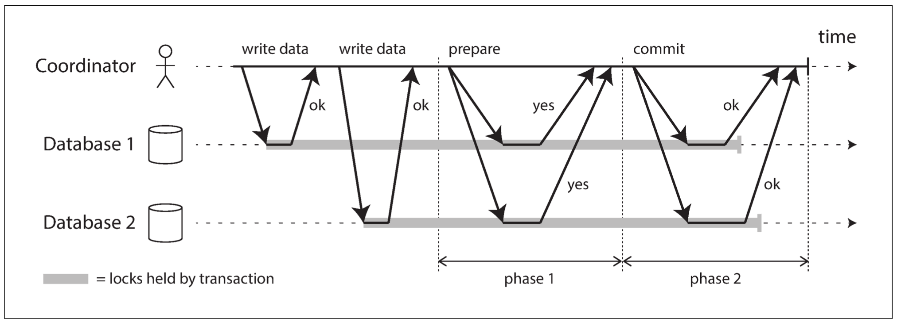

## Designing Data-Intensive Applications: The Big Ideas Behind Reliable, Scalable, and Maintainable Systems

by Martin Kleppmann

### Part 1: Foundations of Data Systems

#### Chapter 1: Reliable, Scalable, and Maintainable Applications
- Some trends for today's data systems:
     - New tools for data storage and processing blurs the boundaries of traditional databases, e.g. Redis, Kafka.
     - Each application is architectured as a conglomerate of components, each with a specific purpose, e.g. db + cache + search index + message queue.
- Reliability
     - Meaning the system continues to work correctly even in the presence of faults (fault tolerant, resilient).
     - Hardware faults: disk failures are super common in large data centers. Solution is usually data redundency.
     - Software errors: leap seconds, slow/unresponsive dependent/upstream service, cascading failures. No magic solution, but can do testing/monitoring/self checking assumptions at runtime.
     - Human errors: usually misconfig. Solutions include designing the system carefully, using sandboxes, adopting good operational procedure/tools (e.g. quick rollback), monitoring and telemetry.
     - Practical tip: to exercise the system for reliability we could do chaos engineering -- introduce faults manually.
- Scalability
     - Describing load: the system's ability to deal with increased load, with some definition of "load" -- differ by individual cases.
     - Describing performance: throughput for batch systems, response time for real-time systems (usually a distribution).
          - In SLA/SLOs performance usually use percentiles: the 50, 90, 99, 99.9th percentile of response times with uptime of a few 9s.
          - Long queues of requests often slow down performance significantly -- head-of-line blocking.
          - The tails are important because a page's performance is dominated by the slowest responding concurrent request.
     - We can scale up and scale out (stateless apps usually easier to scale out), but there's no magic sauce -- the scalable architecture depends on the volume of read and writes, access patterns, data complexity and performance requirements.
- Maintainability
     - Operability: provide observability to internal states/metrics, use automation/integration tools, keep security updates, minimize surprises in behavior, design with portability.
     - Simplicity: use proper abstraction to avoid accidental complexity (that comes from implementation only).
     - Evolvability: anticipate future changes, and be extensible to architecture-level changes.

#### Chapter 2: Data Models and Query Languages
- Data abstraction layers
     - Application layer -- api, objects
     - Db/data structures layer -- as JSON documents, or db tables
     - Db implementation layer -- how to represent them in memory, disk, or network
     - Physical layer -- electrical currents, pulses of light etc
- Relational model vs document model
     - Relational model use cases: transaction processing and batch processing.
     - ORM (object-relational mapping) frameworks hides some mismatch between data in db table and application layer.
     - One-to-many relationships
          - e.g. a Linkedin user has many jobs
          - The document model (JSON = explicit tree structure of an object) has better locality for 1-to-many relationships, compared to the multi-table model (no need to do JOIN queries).
     - Many-to-one relationships
          - e.g. many users live in one region; should we normalize the region to an id (consistency across the board, better search, easier change), or represent it denormalized in a plain string (human readable)?
          - Document DBs have limited support for joins and that put the burden of joins onto application code; often slower than specialized db builtins.
     - Many-to-many relationships
          - e.g. a user has worked for many companies, and each company has many (past) employees; a user can be endorsed by many other users, and a user can endorse many users. 
          - Again document dbs have to deference into those other entities at (typically) application level.
     - Schema-on-read vs schema-on-write for a schema change: document dbs can fill in the fields when reading; relational dbs have to do db migrations (maybe only a couple of milliseconds), and either rewrite all records, or fill in the data on-write.
     - Locality: for document dbs, it's better to access most of the records at the same time and keep the doc small -- a read loads the entire document, and a write usually rewrites the entire document.
     - Nowadays some relational dbs (e.g. postgres) support querying/editing/indexing of Json/XML, and some document dbs (e.g. some Mongodb drivers) auto resolves document references.
     - Summary
          - Document model: flexible schema, better locality, maybe closer to data structures of application.
          - Relational model: better joins, many-to-one and many-to-many relationships; to add constrainst, build an index, and relational db's query optimizer takes care of execution.
          - Bottom line on choosing a db based on the data model: "interconnected-ness" -- does your application have lots of many-to-many and one-to-many relationships?
- Query languages
     - Compared with imperative languages, declarative languages is concise to write, and hide implementation details to executors/optimizers, and is easier to parallelize.
          - CSS is also declaritive.
     - Running customized code
          - Mapreduce is a fairly low-level programming model for distributed execution.
          - Mongodb has some way of supporting mapreduce by executing javascript snippets within queries; it also some declaratives for aggregations.
          - Some SQL databases supports running code snippets too.
- Graph-like models
     - good for: flexible schema, complicated interrelated data
     - vertex: id, outgoing edges, incoming edges, properties (key-value)
     - edge: id, tail vertex, head vertex, relationship label, properties (key-value)
     - Cypher: delaring vertices and edges
     - SPARQL(triple store): (subject, predicate, object) -- predicate indicates edge or property
     - Datalog: rule matches -- each rule generates something like a "new record in the db"
- todos
     - think about how different real world situations things/apps and what they do, and reverse engineer about their data model (both relational and document)
     - case study: Postgres([features](https://www.postgresql.org/about/featurematrix/), [doc](https://www.postgresql.org/docs/current/index.html)) and [Mongodb](https://www.mongodb.com/docs/manual/introduction/) -- what data types/models they support, their replication/sharding model (for fault tolerance and concurrency handling)

#### Chapter 3 Storage and Retrieval
- Indexes: keep some form of metadata structure in addition to the data themselves for fast lookup; speeds up reads but slows down writes because of overhead to keep indexes up to date.
- Hash indexes
     - Requirement: append-only db (log), key-value data, not many keys (index needs fit into memory entirely)
     - Index stores: in-memory dictionary of `{key: byte offset}`, update on adding a new key or updating an existing key
     - Data stores: on-disk binary formatted data (format: len of string in bytes, then the raw string)
     - How do we avoid running out of disk space if data is append-only?
          - Maintain multiple segments of data records (logs): each segment keeps their own in-memory hash index. Close a segment when it reaches a certain size. An offline background thread performs compaction and segment merging (deletes obsolete records and deleted records).
          - Compaction/merging switchover proces: write compacted data to new segment while serving requests from old segments, switch write to new segment, then delete old segments
          - Segments usually several kb and size varies by segment.
          - Read: search for latest segment (each segment keeps their own in-memory hash index), then 2nd to latest etc, merging and compaction has kept number of segments small. Need some sort of linkedlist structure (value being the address of current segment, next points to the next linkedlist node) to keep track of what's latest.
     - Crash recovery: for the hash index, store snapshots of hash on disk (faster than build the index on reboot); for records, have checksums to detect/ignore partially written records.
     - Concurrency: records are immutable and written sequentially, so one write thread, multiple concurrent read threads.
     - Good for
          - Workloads: frequent updates to values of the same keys, e.g. counter to video play frequency.
          - Append and compaction are both sequential writes, faster than random writes.
          - Crash recovery and concurrency is easy under the immutable, append-only model -- no worries of half-edited records caused by a crash or in the middle of changing a value.
          - Compaction and merging keeps data size in check and avoids fragmentation.
     - Bad for
          - Workloads: too many distinct keys -- hash index must fit in memory.
          - Inefficient range queries for keys.
- SSTable (Sorted String Table) (also LSM-tree)
     - requirement: key-value data
     - good for: range queries, dataset much bigger than available memory, high write throughput (because disk writes are sequential)
     - on disk, store SSTables(key-value pairs, sorted by key); in memory, store sparse index for each SSTable to speed up lookup
     - write: write to memtable (in-memory balanced data structure), when memtable's size > threshold, write to disk as a SSTable
     - read: look up for key in memtable first, then latest SSTable (using index to know which chunk it's supposed to be in, then read chunk sequentially), second to latest SSTable...
     - in background, merge and compaction: multi-way sorted merge, take the value of the latest SSTable
     - crash recovery: memtable is lost, so also store unsorted sequential log while memtable is not written to disk and recover from that history
     - LSM-tree (log-structured merge tree) optimizations: use bloom filters to decide if a key doesn't exist; strategies to merge SSTables
     - example: Lucene uses LSM-tree to store (term, list of docs that contains the term)
- B-Tree
     - on disk data structure
     - fixed size(4KB) pages -- when rewrite, overwrite the entire page
     - branching factor usually a couple of hundreds (500?), so 4 levels usually enough
     - read: follow the pointers
     - write: modify in place -- follow pointers and rewrite leaf pages; if leaf's parent is full, break up leaf's parent into 2 pages; delete is tricky
     - crash recovery: write-ahead-log(WAL) before acting on B-Tree to prevent data corruption
     - concurrency: lock on every page
     - optimizations
          - copy-on-write: when update a page, copy the page then update it's address in parent
          - B+ tree: in lower level pages, store only part of the key to increase branch factor
          - leaf pages and sibling pages to aid large range reads (avoid another trip to parent)
- LSM-Tree vs B-Tree
item
LSM-Tree
B-Tree
disk space
smaller, more compact
larger, more segmented
write throughput
typically higher because of lower write amplification
higher, because have to write multiple pages sometimes and write aplification (write-ahead-logs), and have to rewrite the entire page for a couple of bytes
read throughput
1. has to look into multiple data structures and SSTables (worsen by compaction not keeping up), 2. high percentile response times might be large because of waiting for a compaction to finish
predictable
when write requests are high
1. compaction cannot keep up, so data unmerged, so read becomes slow 2. initial write (logging and flushing memtable to disk) has to share write resources with compaction
-
transactions semantics (locks)
-
each key only in 1 single place, so locks can be implemented easily
- other indexing structures
     - clustered index: storing values (with keys also); covering index: store keys and some columns but not all columns
     - multi-column indexes: concatenated index (concat 2 columns, but can't look up 2nd+ col); multi-dimensional index with multi-d range queries: translate 2d to a single number using a space filling curve -- good for geospatial data and others
     - fuzzy index: levenshtien automaton for searching edit distance
     - in-memory database: RAM cheaper, can be distributed, needs write log+snapshot to disk to persist, advantageous because they data don't need to encode in-memory data structures into a disk form -- lots of data structures easier/only available in memory, anti-caching for data larger than memory
- Transaction Processing and Analytics
     - have different db access patterns, so db usually separate
     - OLTP bottleneck is seek time; OLAP bottleneck is disk bandwidth
     - for analytics, it's called data warehousing., usually uses star/snowflakes schema and SQL interface. fact table usually wide (hundreds of columns)
- column oriented storage
     - popular within OLAP (analysis): better than row oriented because in analysis only few cols will be read
     - for finite num of values greatly less than number of record, can use column compression -- bit map then run-length encoding
     - optimizations: use memory bandwidth between main memory and CPU cache, and vectorized processing in CPU
     - sort: sort by 1 col, then by 2nd col etc, helps with data filtering and better compression. can also have several different sort orders
     - write is slow -- writing using LSM tree -- first go in memory, then write to disk in bulk
     - data cubes, materialized views: precomputed data in multiple dimensions
- todos
- look up what's a Bloom Filter and how it's used
- look up how B-Tree works: insert, look up, delete (how it balances itself)

Chapter 4 Encoding and Evolution
- backward compatibility: new code reads old data. forward compatibility: old code read new data
- language specific formats usually is language bound, inefficient, prone to attacks (instantiate objects), and don't have versioning support
- JSON doesn't distinguish integers with floating points, nor does it support binary strings (sequences of bytes without readable text) -- but it supports Unicode
- binary encoding saves space, and have versioning
     - e.g. Thrift and Protocol Buffers defines schema and with tags(numbers) to fields, so reference data with field tag. also variable length so there are length indicators as well as datatype indicators
     - compatibility is limited to some fields (required/nonrequired etc), field names, and some lists
     - Apache Avro
          - Avro has specified schema, and binary data only encode data itself
          - schema evolution done by auto resolving reader's schema with writer's schema: order of fields, new fields (set to default val), removed fields (ignored and must have default value)
          - got writer's schema from beginning of file (lots of records) or record version (have a db for schemas of all versions)
          - good for auto generated schema (don't haven't to hand assign field number etc)
          - good for dynamically typed languages -- no need to do type check
- data flow through DBs
     - in rolling upgrades, both old and new code runs, so data need to consider both forward and backward compatibility, especially if old code drop an added field made by new code
     - db snapshots: better write these records in the same schema
- data flow through services: REST and RPC
     - REST wins: allows client and server to be deployed and evolved independently, evolution made by adding optional request params/adding new fields
     - RPCs: try to make a remote request look like a local request. RPC libraries nowadays have futures/promises to encapsulate asynchronous actions that might fail
- data flow through message passing
     - advantages: buffer for slowness, auto redelivery--reliability, avoids sender knowing IP of recipient, multiple recipients for same msg, sender just sends (logical decoupling)
     - the msg queue usually have flexible data model, but also should consider backward/forward compatibility

#### Chapter 5: Replication
- benefits for data replication
     - low latency (different geographical regions) (roundtrip CA -> Netherlands: 150ms)
     - better scaling (more read load)
     - high availability/tolerance
- master-slave/leader-follower
     - 1 leader to handle writes; leader tells followers to write by sending replication logs; followers are read-only
     - synchronous vs asynchronous replication on write
          - never have all synchronous because that breaks HA
          - semi-synchronous: one sync replica + other async replicas -- so that we always have 2 up-to-date copies of data
          - async: good: continue to service writes even all followers fall behind; bad: weak durability(if leader fails unreplicated changes are lost)
     - setting up new followers
          periodically store consistent snapshots of the leader; copy the snapshot to the new follower, then apply logs later than that
     - failover
          - if follower fails, just catch up with the leader by asking for the write logs later than what it already has and replaying them
          - if leader fails,
               1. detect failure via timeout
               2. select new leader (concensus)
               3. reconfigure all nodes (including the old leader if/when it comes back) to recognize new leader
          - possible issues
               - new leader has a lag from old leader (if async replication), so data might be lost, or has conflicts when old leader comes back up (especially bad if other storages like cache depends on a lagging new leader)
               - split-brain: 2 leaders at the same time, resulting in data conflict/corruption
               - too short of a timeout results in unneeded failovers and further delays system, if system already at high load or with network glitches
     - implementing replication logs
          - pass queries from leader to follower: potential issue being some queries underterministic (RAND), dependent on current db (UPDATE WHERE), or side effects (user defined functions)
          - pass WAL (write ahead logs) to follower: readily available, but issue being WAL usually low level (bytes on disk blocks), making it hard for replicas to run to different software versions, requiring downtime when upgrade
          - pass logical (row-based) logs to follower: logs recording which rows are changed, decoupling with storage details; also good for exporting to external applications
          - trigger based (application level): in relational dbs, a trigger can be fired to log a change in a table when a write transaction commits, so other applications can use it later. more error prone than built-in replication
- problems with replication lag (1 sec+)
     - possible causes
          - machine near capacity
          - network issues
          - recovering from failure
     - problem #1: read-your-own-write consistency
          - requires a read after write should show instantly
          - solutions
               - if something could be modified, read from leader by routing the request to leader's datacenter (doesn't work if everything's modifiable)
               - for 1 min after last write, read from leader
               - client remembers (logical or actual) timestamp of last write, server finds a replica that lags below this for the next read
               - cross-device: member of last write needs to be centralized; route to same datacenter for all devices
     - problem #2: monotonic reads
          - problem: read from first a more up-to-date replica, then a lagging replica; observes data moving back in time
          - solution: ensure each user always read from the same replica (e.g. route with hash of userId) unless the replica fails
     - problem #3: consistent prefix reads
          - problem: when 2 causally related data lands in different partitions, they replicate at different rates (partitions operate independently, no global ordering of events for partitioned systems); may see logically reversed contents
          - solution: application makes sure causually related content are put in the same partition (may not be efficient); or use the tracking algorithm to track causal dependencies
     - bottom line
          - application code needs to be aware of replication lag
          - db could provide distributed transactions (partitioned and replicated) as a guarantee, but at a cost of performance and availability
- multi-leader replication
     - write to any leader, and leaders have ways to sync up asynchronously themselves
     - benefits
          - write performance: otherwise all writes has to go cross-DC onto that single leader
          - tolerance of datacenter outages (one leader per DC)
          - tolerance of network problems: public network not as reliable; single leader is sensitive to network since all writes are synchronous
     -  use cases/scenarios for multi-leader
          - multiple data centers: 1 leader per DC; between DCs leaders replicate to each other after conflict resolution
          - applications/clients that still works without internet connection, e.g. in a calendar app, viewing/changing meetings while offline means it's 1 leader/DC per device, and network extremely unreliable
          - collaborative editing: one user/device as a db leader for faster collaboration, or single-leader transaction for slower collaboration (locking)
     - write conflicts
          - happens when two writes goes into 2 different leaders and both gets OK -- need to resolve asynchronously
          - usually applies to individual row/records, even in a multi-write transaction
          - solution #1: avoiding it: ensure each record is handled by only 1 datacenter; breaks when rerouting traffic to another datacenter etc
          - solution #2: resolve in a convergent way
               - take the write with higher write ID/replica ID/timestamp(aka Last Write Wins); loses data
               - merge values (concat for strings by alphabetical order)
               - record the conflict in a data structure, and write application code to resolve conflict
          - application code for conflict resolution
               - on write: predefine a handler code and run it instantly at conflict detection
               - on read: when read, run code (either instantly or prompt user to resolve), then write back
     - communication topologies among multiple leaders
          - circular, star/tree
               - data passes through multiple nodes, so need to remember which replica the data has passed through in the rep log to ignore it when arrives at self
               - problem: one single failed node interrupts the flow, reconfiguration is manual/tricky
          - all-to-all
               - problem: when some leaders' network is faster than others, a leader receives time-reversed replication requests
               - cannot use timestamp (clock skew)
               - can use version vectors to order these events
- leaderless replication (e.g. Amazon Dynamo)
     - write to all n replicas at the same time and wait for OK from w replicas, read from all n replicas and wait for r values, then select the newest value by versioning
     - quorum consistency: when w + r > n, read and write overlaps -- guaranteed to have the newest value; usually pick odd n with w = r = (n + 1) / 2
     - previously down replica to catch up
          - read repair: when read, client sees stale value so client writes back to that replica; good for frequently read records
          - anti-entropy process: background process to check and repair inconsistencies; without this values rarely read may have reduced durability
     - multi datacenter
          - option 1: send write to all nodes in all dcs, read usually wait for the local nodes because they're fast
          - option 2: send read and write locally, and cross-dc replication happens async like multi-leader model
     - limitations for quorum consistency even when w + r > n
          - if using sloppy quorum, then reads are no longer guaranteed to overlap with writes (because writes have temporarily moved to other nodes)
               - sloppy quorum: when number of nodes >> n (maybe the db is partitioned) and network partitition happens, the db still accepts writes from clients cut off from the usual n nodes, and store data temporarily on a different set of nodes
               - hinted handoff: write the value back to the original nodes when they're back
          - concurrent writes cause conflicts -- has to merge values, since timestamped LWW suffers from clock skew
          - for concurrent write and read, values returned to read is undetermined
          - if write acks < w, values are not rolled back on succeeded nodes -- later reads may see the value from the failed write
          - number of replicas holding new value falls below w, if we copy data from a stale replica when a replica fails
     - monitoring staleness
          - for leader based dbs, just measure the difference between the follower's position in replication log from the leader's
          - for leaderless dbs, not common in practice
     - concurrent writes: detection and resolution
          - problem: events arrive in different order on different nodes, due to network delay and paritial failures; but nodes should converge to a consistent value regardless to be eventually consistent
          - Last Write Wins (LWW)
               - force an ordering of writes, e.g. timestamp, discard earlier ones
               - cost for durability: may even drop nonconcurrent writes (timestamps are not reliable)
               - the only safe way to use LWW is when a key gets written only once (immutable records): e.g. assign a UUID per write as the key
          - concurrency is determined by whether two events know of each other, regardless of their actual timing
               - A causal relationship is not concurrent, e.g. insert a=3 and update a=5 are not concurrent, but insert a=3 and insert a=5 are
          - making concurrent writes
               - example
               
               - for each key, server maintains multiple <version #, value> pairs with the latest version number -- it increments the latest version number with every write, and stores the version number together with the value written
               - client must read before a write to make sure it's seeing the most up to date value from the server
               - on read request, server returns all values (not overwritten) with the latest version number
               - when writing, client merges all values received in previous read (either using custom implementation or data structures like CRDT), add its change, and include the version number that the change and merge is based on (use tombstone for deletes)
               - on receiving a write request with version number n, server overwrites all values with version number n or below (they're already merged by client), but keep values with versions higher than n (they're concurrent with this write)
               - for multiple replicas, use one version # per replica per key, forming a version vector
- questions
     - how do you take a consistent snapshot while serving reads and writes?
     - conflict resolution: 2-way merge(CRDT) vs 3-way merge(mergeable persistent data structures), what's the difference?

#### Chapter 6: Partitioning
- each node like an independent db, only that they collectively return the right answer; complex queries may need multiple partitions to cooperate
- one node may host multiple partitions and replicas, and is a leader in some partitions and follower in others
- ways to partition
     - goal: spread data/query load evenly, avoid hot spots
     - by key range
          - keep key in sorted order and set boundaries between keys (chosen manually or automatically)
          - good: range queries efficient
          - bad: possible hot spots on some queries -- can use an alternative key
          - rebalancing: dynamic (split to 2 when partition size over a threshold)
     - by hash of the key
          - hash keys using a good hash function (e.g. md5); boundary evenly spaced, or chosen randomly (a.k.a. consistent hashing)
          - good: less prone to hot spots
          - bad: no range queries
          - rebalancing: common to have a fixed number of partitions then move the entire partition; can also use dynamic partitioning
     - compound
          - compound primary key: first column by hash (for partitioning), and later columns concatenated for sorting
          - good: supports range queries with a fixed partition key to model one-to-many relationships, e.g. (userId, timestamp)
- skewed workloads
     - skewed workloads happen for situations like celebrity
     - solution without db native support: adding a 2 digit random number to spread the load to 100 nodes
          - but reads now requires to hit all 100 nodes
          - and this needs additional bookkeeping to know which key are split and how they're split
- partitioning with secondary indexes
     - secondary indexes: usually one key (secondary index) corresponds to multiple rows for search; doesn't map to partitions easily since partitions are done with the primary key
     - document-partitioned indexes (local indexes)
          - each partition keeps its own index
          - good: fast writes because it only writes to one partition
          - bad: scatter-gather; need to read from all partitions so it's expensive and prone to tail latency amplification
     - term-partitioned indexes (global indexes) 
          - global index of all data, stored in partitions based on term (range scans), or hash of term (even distribution)
          - good: read is fast -- only query the index then go to the actual data
          - bad: write needs to be on multiple partitions because index of different terms are on different nodes, requiring distributed transaction support (in practice index updates are usually async, so reading index immediately after write doesn't give the updated data)
- rebalancing
     - moving load from one node to another
     - scenarios: query throughput increases, need more CPUs to handle; data size increases, need more disk/RAM to store; machine failure, need replacement
     - requirements: fair share of loads, continue to serve read+write while rebalancing, move only minimal amount of data
     - fixed number of partitions
          - make lots of partitions (p >> n), only move entire partitions across nodes
          - partition size proportional to data size
          - challenging to decide on the number of partitions (partitions incur maintenance overhead, but when partitions are large, rebalancing/recovery is expensive), especially when data size is highly variable
     - dynamic partitioning
          - split and merge partitions as the size of the partitions change
          - number of partitions grows proportionally to data size
          - good for adaption to data size; with an empty db, you can configure initial partitioning
          - can be used for both key-range and hashed partitions
     - partitioning proportional to nodes
          - fixed number of partitions per node, since num of nodes usually grow with data size, partition size is usually stable
          - when a new node joins, it randomly splits a fixed number of existing partitions and move those splits into the new node (consistent hashing)
          - partitions are split by random, so requires hashed partitioning (could create unfair splits, but mitigated with p >> n)
     - operations: rebalancing is expensive (moving huge chunks of data and rerouting), and auto-detection + auto-rebalancing can exacerbate a problem -- need some human intervention
- request routing
     - knowledge of which partition is kept at which node can be kept in one of these places
          - all nodes: request hits a random node (IP not changing as much, so enough to use DNS), then forwarded to the owning node
          - a routing tier: forwards requests to the owning node; needs to have HA too
          - the client(s): directly connects to the owning node
     - knowledge is distributed across different places, so usually delegates the knowledge to Zookeeper, and have nodes/client subscribe to Zookeeper updates
          - zookeeper stores (key-range, partition, node, IP address)
     - alternatively in the all-nodes scenario, can use a gossip protocol so it doesn't rely on external service discovery
     - in data warehouses, MPP(massively parallel processing) query optimizer breaks down a complex query into execution stages on partitions for parallel execution

#### Chapter 7 Transactions
- why
     - provides an abstraction to simplify the programming model by grouping several reads+writes into a unit
     - either commits or aborts, so applications don't have to worry about partial failure, and can safely retry
- the safety guarantees of transactions: ACID (meaning is ambiguous -- mostly a marketing term)
     - atomicity (abortability): guarantee that if a group of several writes fails halfway, the group can be retried safely, because the db has undone any writes so far
     - consistency: application data is in good state (invariants still hold) -- but it's determined by application, not the db
     - isolation
          - concurrent transactions are isolated from each other: one transaction (a transaction may include a few writes on different objects) can't see another's uncommitted writes
          - e.g. of violation to isolation: the concurrent read-modify-write
          - also called serializability -- concurrent as if actions are made in serial
     - durability
          - once transaction is committed, it will not be forgotten even in case of hardware failure or crash
          - in a standalone db it means data is written to disk; in a replicated db it means data has been written to several nodes
          - but nothing's absolute; disks can fail, ssd can get corrupted, power/node outage for in-memory dbs etc
- single object and multi object transactions
     - always provided: dbs universally provide atomicity and isolation on the level of a single object via log (for crash recovery) and lock (for isolation) on objects
     - sometimes provided: to prevent data loss in a concurrent scenarios, some dbs provide automic increment, and/or CAS (compare-and-set) -- allowing the set to succeed only if value is not changed by someone else (otherwise retry)
     - not all provides: transactions on a group of multiple objects is tricky to implement on a distributed scenario, and is costly on performance, but there's still need for multi object transactions
          - in relational model, foreign key reference requires updating multiple tables
          - in denormalized document db, different fields and documents need to be updated (e.g. email records has a is_unread field, and mailbox records has a num_unreads field to avoid counting unreads)
          - for secondary indexes, both the index and the doc needs to be updated
     - handling errors and aborts
          - best effort dbs (like leaderless) requires better handling in application level
          - problem with retries
               - if action succeeded but network back failed, a retry replays the action, unless there's application dedup in there
               - retry due to overload worsens the problem, should limit the number of retries, use potential backoff, and handle overload issues separately (is it even possible?)
               - retry is only useful to transient errors (deadlock, isolation violation, network, failover etc)
               - side effects might be duped because they happen even if abort; e.g. sending the email twice, so should use two phase commit (2PC)
               - if the data in client is kept only in memory, and during the (lengthy since there are backoff) retry process if the client failed, data is lost
- It's not easy to test for concurrency issues in a large database (hard to reproduce and not knowing which other code is accessing the db), but serializable isolation has a performance cost, so dbs try to provide some weaker level of isolation.
- weak isolation levels
     - read committed
          - only read committed data (no dirty reads), and only overwrite committed data (no dirty writes)
          - no dirty reads prevents problems: other readers won't see partial updates if updates on multiple objects, and if aborts then uncommitted data won't be read by others
          - no dirty writes prevents problems: when 2 transactions both act on 2 same objects, and a transaction enters early and exits late, it's 1st value written is lost to the 2nd transaction
          
          - does NOT guard against: read-modify-write data races (e.g. 2 concurrent counter increments), since the 1st write is already committed; or the repeatable reads problem
          - implementation
               - dirty writes prevented by row-level locks (don't release lock until transaction completes)
               - dirty reads prevented by the same locks (unpopular because of performance dip from long running transactions), or keeping both an uncommitted version and an old version and serve the old version while the write transaction is running
     - snapshot isolation/repeatable read
          - nonrepeatable read/read skew: a read transaction reads 2 objects, and in between the 2 reads, a committed write transaction modifies both obj (e.g. account transfer) -- but this read result won't be repeated
          
          - when nonrepeatable read can't be tolerated (long running, read-only transactions)
               - db backup may take hours, and it can't read nonrepeatable result, otherwise it'll backup inconsistent values
               - analysis or integrity checks touches a large part of db, and it might fail if seeing these transiently inconsistent data
          - snapshot isolation prevents it: each read transaction sees a consistent snapshot of the db at a particular point in time (at the start of itself); even if data is changed by some later transaction, they won't be seen
          - implementation
               
               - generalizing on keeping 2 versions (old and during transaction), the db keeps several different committed version of db -- MVCC (multi-version concurrency control)
               - each transaction assigned an always-increasing transactionId
               - each db row stores multiple versions, each version has fields: id, value(s), createdBy (transactionId), deletedBy
               - each write operate translates to a delete and a create, and modifies the row metadata accordingly
               - reads observes an object(i.e. row metadata entry) value only if both the 2 conditions are true (requires compiling a list of all in-progress transactionIds when the transaction starts):
                    - at the time that this read transaction started, the transaction creating this object is already committed
                    - the object is either not marked for deletion, or it is but the transactionId isn't committed at the time this read transaction starts
          - in effect, readers never block writers, and writers never block readers
          - ways indexes work for a multi-version db
               - can have index pointing to all versions of the object, and filter by visibility given the transactionId, then garbage collects the index entries together with old versions
               - use append-only, copy-on-write B-tree (similar to [git](https://github.blog/2020-12-17-commits-are-snapshots-not-diffs/)) for the entire db -- each transaction creates a new tree root; also needs garbage collection
     - preventing lost updates
          - examples of read-modify-write: account balance read then update, adding an item to a list of JSON, concurrently editing wiki articles (save the entire document)
          - atomic write operations
               - usually implemented with locking on the object before read and release after write
               - alternatively can force all atomic writes to be executed by 1 single thread
          - explicit locking
               - e.g. for multi-player control of an avatar, automic write doesn't apply since we also need to integrate logic to check move isValid within the locking section
               - prone to errors because people forget to lock
          - auto detect lost updates
               - if detected, force one writer to abort and retry
               - can be implemented efficiently with snapshot isolation
               - better than explicit locking because it doesn't require users to do anything
          - compare-and-set
               - when updating, compare with old value and set only when data hasn't been changed
          - when there's replication, concurrent writes happen on multiple nodes
               - since there's no single up-to-date copy of the data, lock and compare-and-set wouldn't be effective (because they're non-deterministic?)
               - atomic operations still works, best for commutative operations (increments, adding to a set etc)
               - best to hold multiple versions of values (siblings) and resolve later on
     - write skew and phantoms
          - examples of write skew
               - both doctors select table of (name, is_on_call) to see if num_oncall > 2 at the same time, see yes under snapshot isolation, and both commits to take their name off call
                    - solution: explicitly lock all rows (WHERE oncall = true) to disallow further reads and writes until the update is complete
               - two organizers check if the same room is taken during the same meeting period by checking, see no under snapshot isolation, and both book the slot
                    - solution: materializing conflicts. Create a table of for every room every 15 min for the next 6 months, lock these slots upon querying and release after the update
               - 2 players controlling the same character tries to move it to the same coordinate, checks if there isn't already another item on the coordinate, see yes under snapshot isolation, and both move to the same position
               - two users try to create the same username by checking if this name is taken at the same time, see ok under snapshot isolation, and both take it
                    - solution: use the db's unique constraint (2nd attempt will force an abort)
               - a user spend game money concurrently by first checking if the remaining balance would be > 0, see yes under snapshot isolation, and both commits the action
          - how does the problem happen
               1. a select query checks if some condition is satisfied by searching for multiple rows that satisfies some condition
               2. depending on the result, the application code either aborts or goes ahead
               3. going ahead, the application code modifies one or multiple objects so that it changes the precondition returned in step 1
          - write skew is the generalization of lost updates (read-modify-write) -- two transactions concurrently read a few objects and updates some of them. When they update the same object, it's a dirty write or a lost update depending on the timing
          - phantom: the effect that a write in one transaction changes the result of a search query in another transaction
          - solutions
               - similar to detecting lost updates, use a db that provides true serializable isolation level
               - use db constraints (e.g. unique)
               - lock up all obj during the first read query (including materializing conflicts)
          - materializing conflicts
               - if query checks for the absence of something, have a table that materialize it so that they could be locked up; this turns the phantom into concrete rows to lock on
               - a last resort because it's error prone and ugly
- serializability
     - strongest isolation level, guarantees that all transactions have result same as serial
     - why: other weaker isolation levels are hard to understand (implementation wise), it's hard to debug a race, and there's no good tools to detect a race
     - actual serial execution
          - execute on one thread on one core
          - on a recent development because
               - RAM is now cheaper so we can store all data in memory, so each transaction is fast enough
               - OLTP is usually shorter than analysis, and analysis is usually read only so it's served on a snapshot
          - transactions needs to be fast to unblock other ones: encapsulate transactions as stored procedures (each procedure includes multiple db accesses) so it avoids waiting for multiple IO and locking overhead
               - modern stored procedures uses existing general purpose programming languages
          - caveats of single thread execution
               - limited to data that fits into memory; if data not in memory then it should abort the transaction, load data into memory asynchronously, then retry
               - write throughput needs to be low enough to be handled by single thread
               - partitioning may speed it up (one thread per partition), but if coordination between partitions is required, it's very slow (e.g. secondary indexing) since it requires actual lockstep execution across multiple partitions
     - Two-phase locking (2PL)
          - reads can be concurrent, but once there's a write, read is blocked by write and write is blocked by read until transaction is committed/aborted
          - implementation
               - locks in shared-mode (readers) and exclusive-mode (writers)
               - once acquires a lock, must hold until commit or abort
               - deadlock happens frequently because of so many locks involved -- db detects deadlocks automatically, and aborts one of them to later retry by application
          - performance
               - overhead to acquire and release locks, especially since so many locks are involved, aborts and retries are common
               - reduced concurrency: transactions can be any length, and even one long transaction stalls subsequent transactions
               - deadlock can happen more frequently
               - overall, 2PL dbs have unstable throughput with long tails
          - predicate locks and index-range locks
               - predicate lock: a lock in the forms of a predicate (a SELECT clause) that belongs to all objects (even future nonexistent objects) -- also with shared and exclusive mode
               - predicate lock + 2PL prevents all forms of write skew and race
               - index-range(a.k.a. next-key) locks lock by index range as approximation of predicate lock in implementation; e.g. meeting room bookings has indicies either by time range or by room, so it locks on the targeted time range of all rooms, or this room at all times
               - index-range locks lock a superset of the required objects on the index, so it usually achieves better performance than predicate locks
               - if index not available, the db locks on the entire table
     - Serializable Snapshot Isolation (SSI)
          - a fairly new idea that's been implemented by both single node and distributed db
          - optimistic concurrency control: based on snapshot isolation, don't block until commit time to detect serialization conflicts
          - idea: make sure to detect if read is stale -- abort if it's the case
               - case 1: detecting read of stale MVCC objects
                    
                    - event sequence: A reads, A writes, B reads (reads a stale MVCC obj), B writes, A commits, B aborts
                    - transaction monitor detects B reading uncommitted change made by A
                    - wait for commit time to decide whether OK or abort, because A might have aborted or B could be just read-only
               - case 2: detecting write that affects previous read
                    
                    - event sequence: A reads, B reads, A writes (notify B), B writes (notify A), A commits, B aborts
                    - use index-range lock (or similar mechanisms) to detect and notify each other
                    - db only needs to remember what data has been read until all concurrent transactions are done
                    - the first committer wins, others abort
          - performance
               - better than pessimistic when load is not too high; otherwise causes too many retries that worsen the load
               - also depends on implementation details like tracking granularity that affects overhead
               - can expand to replicas and partitions, achieving high throughput
               - response time less variable -- reads run on consistent snapshots without locks so it's good for read-heavy applications, but long writes more likely to meet a conflict and abort

#### Chapter 8 The Trouble with Distributed Systems
- unreliable networks
     - can't distinguish between: bad/slow outgoing network, unavailable recipient, busy receipient (load spike or doing GC), or bad/slow incoming network
     - detecting faults
          - timeout is the most general way to detect faults
          - sometimes there are explicit messages: if process crashes the os may send RST/FIN TCP packet or even notify other nodes, may be access network switches at physical level etc
     - timeout
          - if too low, might be false positive, overloading the entire system which is already overloaded, or premature failover leading to an action performed twice
          - unlike telephone lines that establish a preset channel end-to-end for each session (bounded delay), TCP is designed to handle bursty traffic, resulting in unbounded delays
          - can choose timeout by experiments and/or auto-adjust with jitter
     - network congestion and queuing
          - causes
               - if multiple senders send packets to the same desination, a network switch has to queue them up and feed them one by one into the destination link, or dropping packets if the queue is full
               - a destination machine with busy CPU cores queues incoming requests from network (by the OS) until the application is ready to handle it
               - an VM monitor buffers/queues incoming data from network when another VM tenant uses the CPU core
               - TCP performs flow control so queueing may happen at the sender (even before data enters the network)
               - TCP auto-transmits packets that timeout, resulting in increase in observed delay
           - in public clouds and multi-tenant datacenters, network links/switches are shared (or even network interface+CPUs are shared in VMs), noisy neighbor can consume lots of resources (e.g. MapReduce batch workloads)
- unreliable clocks
     - time-of-day clocks
          - synchronized via NTP (Network Time Protocol), may jump back
          - not suitable to measure elapsed time since it may jump back
     - monotonic clocks
          - always move forward, but absolute value meaning different things on different servers (even CPUs on the same server)
          - NTP may adjust how fast it moves forward
          - suitable to measure elapsed time to the microseconds
     - possible issues with clock synchronization
          - servers have clock drifts up to 17 seconds/day if synchronized once per day, so the clock may jump back or leap forward
          - NTP firewalled/misconfiguration makes servers unable to synchronize for a long time
          - synchronization accuracy itself is limited by internet delay, and in the case of congestion the client may abort synchronization 
          - NTP servers may or may not smear the leap second, since some systems are not aware of the leap second
          - VM sees virtualized clock, and the hypervisor context switch results in VMs seeing clocks jumping forward
          - if app run on a device you don't control (someone else's phone) the time may be intentionally wrong
     - relying on synchronized clock
          - if an application relies on synchronized clocks, it should monitor clock drifts closely because it causes subtle failures
          - e.g. timestamps for ordering events
               - multi leader db propagates writes to follower, by "last write wins" principle, the write on faster clock wins, causing dropped writes from the lagging clock
               - LWW dbs can't distinguish between writes happen in quick succession, or truly concurrent ones -- has to use version vectors to track causality
               - may have two requests with the same timestamp (on different machines), so LWW dbs need a tiebreaker rule
               - NTP doesn't solve the problem because NTP itself has internet delay so it's accuracy is limited
               - can use logical clocks instead of time-of-day clock or monotonic clock
          - clock reading have a confidence interval, but no way to estimate the interval
               - for snapshot isolation in a distributed db, generating a monotonically increasing transaction ids becomes a bottleneck (for a single instance db a counter is sufficient)
               - Google's Spanner implementation waits for the confidence interval before commit read-write transactions to make sure the read transactions don't overlap with the read-write transaction
     - process pauses
          - example: get incoming request -> check if lease expiry is at least 10 seconds later otherwise renew lease -> if lease is valid (if thread is preempted here for over 10 seconds, it'll process the request with an expired lease), process request (solution: use a fencing token on the server side)
          - possible causes
               - garbage collection stops the world (can spend up to minutes)
               - on virtual machines, can get suspended and restarted for live migration
               - on laptops, can get suspended when user closes down the laptop
               - operating system context switch
               - unexpected wait for disk IO (if disk is via network then even more delay)
               - os's frequent swapping to disk (thrashing)
               - getting SIGSTOP and SIGCONT signals (e.g. CTRL-Z)
          - there are real-time response guarantees for life-critical embedded systems, but it's expensive and limited
          - tricks to reduce GC impacts: treat GC as planned maintenance time and have other nodes take over during GC, or use GC for short-lived objects that are fast to collect then periodically restart nodes like rolling upgrades
- knowledge, truth and lies
     - truth is defined by majority
          - problem: a node gets stopped by GC when lease expires, meanwhile another node gets lease and writes data. after first node comes back it tries to write -- then data corrupted
          - solution: fencing. The distributed locking service distributes an increasing fencing id to each lock holder, and server rejects updates from older fencing id.
          
     - byzantine faults
          - faults when some nodes are malicious or working deliberately incorrectly
          - used in aerospace environments (radiation corrupts memory) or peer-to-peer (bitcoin), but too expensive in other places
          - because all/most nodes runs the same software, byzantine fault tolerant algos won't save the situation
          - weaker corruptions can be saved by sanity checks: checksums in application level protocol, sanitizing inputs, using multiple NTP server addresses
     - system model used to design a distributed algorithm, and reality
          - timing models
               - synchronous model: bounded network delay, clock error, and process pauses -- unrealistic
               - partially synchronous model: bounded most of the time but occasionally can be bad -- realistic
               - asynchronous model: no timing assumptions (can't use clock at all) -- restrictive
          - system failure models
               - crash-stop faults: when faults happen, node crashes and never comes back
               - crash-recovery faults: after crash, takes some unknown time to come back -- assumes that disk gets persisted between crashes, and memory doesn't
               - byzantine faults: nodes can do anything including deceiving
          - evaluating distributed algos
               - correctness -- listing properties of an algo and make sure it behaves this way
               - e.g. generating fencing tokens requires these properties to be correct: uniqueness, monotonically increasing, availability (a node requesting a token eventually receives a response)
               - safety and liveliness properties
                    - safety: something that always hold, and no bad things happen because once a damage is done there's no going back
                    - liveliness: something that eventually happens (e.g. eventual consistency)
               - models are simplifications of reality (implementation) but nevertheless provides great insights

#### Chapter 9 Consistency and Concensus
- eventual consistency is a weak consistency guarantee, since you can't assume when the data is available to read after the write
- linearizability (a.k.a. strong consistency/immediate consistency/atomic consistency)
     - definition
          - provides the illusion that there's only 1 copy of data, and all operations on it is atomic -- once an operation is executed, all subsequent (non-overlapping in time) operations conforms with it -- no going back
          - is a recency guarantee -- concurrent operations may be either old or new value, but subsequent ones are all new vals
          - think of it as being able to find points in time for all executions of read, write, and cas
            
     - not to be confused with with serializability (an isolation guarantee on transactions)
          - 2PL and actual serial execution is linearizable
          - serializable snapshot isolation is not linearizable because reads were on older snapshots
     - examples that rely on linearizability
          - distributed locking and leader selection: the lock needs to be implemented on a linearizable datastore (e.g. etcd, zookeeper)
          - uniqueness constraints in a distributed db: like a "lock" on the username, or a cas to set the username to the id if it's not taken; also account balance, warehouse stock level, seat occupancy (single up-to-date value that all nodes agree on)
          - multi channel timing dependencies: e.g. store to object store, send to message queue, server receives the message and pull object from the store; the message queue has a race with object store's internal replication. Solution: use linearizable object store (after the write is done, read is guaranteed to see the write result), or use any "read your own write" solutions
     - implementation
          - single leader -- might be linearizable
               - might be linearizable only if reads also come from the leader (but not if using snapshot isolation); but not linearizable when failover (could even lose data), or having split brain
          - multi leader -- is not linearizable because of the async nature
          - leaderless -- almost never linearizable
               - sloppy quorum violates linearizability, and LWW (last write wins) relies on time-of-day clocks which is nonlinearizable
               - even when strict quorum (w + r > n), when a write is in progress (due to network latency) with 2 reads reading from different sets of quoroms, the first read may see the new value when the later read sees old value
          - concensus algorithmss -- linearizable (e.g. etcd and zookeeper)
     - the cost of linearizability
          - the CAP theorem
               - when network partitioning happens (some nodes detached from network), either db is available but not linearizable/consistent, or db is linearizable but not all available
               - e.g. think of multi leader db in separate datacenters, when partitioning happens, system is available but 2 datacenters are not consistent
               - e.g. for single leader db, when network is partitioned, the partition without the leader can't accept writes
          - even RAM on CPUs isn't linearizable: one CPU changes main memory, and another reads shortly afterwards, it may not see the change, since it has cache fronting it
          - linearizable systems' response time is at least proportional to the uncertain network latency, so performance is a big issue
          - most dbs don't have linearizability, some has weaker consistency models
- ordering guarantees
     - ordering and causality
          - causality consistency
               - a system is causally consistent if it obeys the ordering imposed by causality, e.g. snapshot isolation provides causality consistency (can see all data precedes it)
               - weaker than linearizability, but it doesnt' have the coordination overhead, and it less sensitive to network problems
          - causal order is not a total order
               - total order: everything can be ordered, e.g. natural numbers; partial order: some items can't be ordered, e.g. sets
               - e.g. git's commits tracks the causal orderings, branches and merges make it not a total order
               - a linearizable system: total order because there has to be a point when each operation happens atomically
               - a causality consistent system: partially ordered because you can't tell which happens before for concurrent requests
          - linearizability is stronger than causal consistency
               - linearizable system automatically preserves causal consistency, but performance takes a hit
               - causal consistency is the strongest consistency level that doesn't hurt performance due to network delays, and available in network failures
          - implementation for causal consistency (for nonlinearizable systems)
               - to preserve causality, the db needs to know and track which happens before which, and make sure it happens in all replicas
               - keeping track of partial ordering can be done similar to detecting concurrent writes and serializable snapshot isolation -- needs to track which version of data is read by the application
               - can track this not only on single objects, but across the entire table with generalized version vectors
     - sequence number ordering
          - useful to assign sequence numbers (a.k.a logical timestamps) to operations to create a total ordering that's consistent with causality (concurrent ones assigned arbitrarily)
          - single leader's replication log number is a total ordering consistent with causality. if not single leader (either partitioned or multi/leaderless), ways to generate noncausal sequence numbers:
               - each node generates its own, preserve some bits to indicate node numbers
               - attach number with time-of-day clock if resolution is accurate enough
               - preallocate blocks of range for different nodes, reassign new blocks when current range runs low
               -> these are all scalable, but none of them preserves causality in their ordering
          - can use the Lamport timestamps to do a total ordering of events on a distributed system
               - Lamport timestamps are pairs (counter, nodeID) -- first compare counter, if counter are same, compare nodeID
               - for each request, node increment the counter id by 1 over the id sent by client
               - for each request, client keeps the max counter id replied from nodes (seen so far), and include that in the next request
               - by client sending requests to different nodes, its id essentially syncs the order happening around all nodes (max of all nodes)
               - concurrent operations on different nodes may have the same counter but different nodeID
          - timestamp ordering (like Lamport) is not sufficient
               - because the total ordering is finalized _after_ all ids are collected, at the time of request you don't know if other nodes are doing anything concurrent
               - e.g. for unique constraints problem, two concurrent operations can't know what the other nodes are doing at that point (if asking all nodes synchronously, then if some node goes down the system stops)
               - need to use broadcasting to know _when_ the ordering is finalized
        - total order broadcast
           - a single leader (single partition only) can determine a total ordering, but the challenge is to scale beyond 1 leader can handle, and handling leader failover
           - a protocol for nodes to exchange messages, requiring 2 properties always satisfied
                 - reliably delivered to all nodes (if a msg is delivered to 1 node, it's delivered to all nodes)
                 - totally ordered delivery (all nodes receives msg in the same order)
            - notes
               - if node/network is faulty, no msg is delivered but when it's back, deliveries gets retried and in the same order
               - the order of the messages is fixed upon delivering; no retroactively insert to a earlier position
            - uses of total order broadcast
                 - db replication (msg as writes to db, all nodes gets them all and gets them ordered) -- state machine replication
                 - implement serializable transactions -- each msg represents a stored procedure for each replica to execute
                 - like creating a log -- each msg delivered is to append to the log, so log is ensured to be the same order on every node
                 - lock service for fencing tokens -- the order that the service arrives are kept in sequence ids, which can be tokens
            - implementing linearizable compare-and-set using total order broadcast (strong link between total order broadcast and linearizability)
               - uniqueness constraints can be modeled as compare-and-set(null, username) on all possible usernames on linearizable storage
               - use total order broadcast as a log: append to the log tentatively taking the username; read the log to wait for the msg to get back; commit if the first log entry taking the username is your own, otherwise abort
               - write is linearizable, but read is not if reading from an async updated replica
                    - to make read linearizable, read from a sync replica, perform the read when the message is delivered back, or query for the log position and wait for all previous log to arrive to perform the read
            - Implementing total order broadcast using linearizable storage (strong link between total order broadcast and linearizability)
               - assume a linearizable store of an integer, for each outgoing message, increment-and-get the integer as the sequence number, and send to client with resend
               - since sequence number has no gaps, client can know to wait for a missing sequence number if got another later message
               - doesn't work if node fails for network is interrupted -- need concensus
- distributed transactions and consensus
     - problem: get nodes to agree on something -- actually pretty hard
     - scenarios requiring consensus
          - leader selection (and reselection in failover): agree on any leader
          - atomic commit: decide to commit or abort in distributed transactions, but if one node votes no, all need to abort
     - atomic commit and Two-Phase Commit (2PC)
          - single node commit is implemented by the storage engine
               - first write data (write ahead log), then write a commit record to the WAL
               - critical moment to decide if commit or abort: the moment when the disk finishes writing the commit record
               - when crash happen before writing commit record, abort; if crash after the commit record, it's considered committed
          - challenges for multi node transactions
               - if simply ask each node to commit, some individual partitions/nodes/obj can fail, leaving partially committed state, voilating atomicity
               - possible reasons for violation of atomicity: a node detects constraint violation/conflict and need to abort, some commit msg lost in network and eventually need to abort due to timeout, nodes may crash before commit record written
               - once data is committed, there's no way to retract it, since data is available to subsequent transactions, so we need commit to happen only once per node when other nodes can commit
               - 2PC is at db level; at microservice level it can be done with [saga pattern](https://microservices.io/patterns/data/saga.html)
          - Two-Phase Commit (2PC)
               - the most common distributed transactions implementation
               - there's a transaction coordinator implemented as a library in the client, or as a separate process/service
               - step 1: before the transaction, ask coordinator for globally unique transaction ID
               - step 2: each partition to read/write data as normal (aborts can happen) -- start holding locks
               - step 3: coordinator send "prepare" msg to each node (if any request time out or fails, send abort to all nodes)
               - step 4: nodes write to disk and check for conflicts etc, then answer "yes" or "no" (once voted yes, it has to commit in all occasions no matter what)
               - step 5: the coordinator makes a decision, write the commit record (the commit point)
               - step 6: coordinator sends "commit" (or abort) requests to each node (if request time out, keep trying until get an answer) -- nodes release locks after commit
               
          - coordinator failure
               - if coordinator fails after sending out prepare requests, participants can't abort nor commit on their own since they don't know the decision of the coordinator
               - coordinator has to write the decision to its own transaction log before sending out the decision of commit or abort
               - participants can only wait for coordinator to answer -- when coordinator comes back, check its own transaction log, and if there's no commit record, abort
          - there's a 3 phase commit for nonblocking distributed commits, but it assumes bounded time so it's not useful in common scenarios
     - distributed transactions in practice
          - most dbs don't choose to implement distributed transactions for performance and operational troubles except for SQL-series
          - 2 types of distributed transactions
               - db-internal: a db that offers replication & partition natively -- works ok
               - heterogenous: 2+ different technologies, e.g. atomic commit for db + message broker -- challenging
          - exactly-once msg processing
               - example of a heterogeneous distributed transaction: commit the msg acknowledgement (from message broker) and db write (and other side effects) in a single atomic transaction
               - effectively exactly-once processing: if either one failed (aborted), the entire transaction gets aborted with no side effects, so that it can be retried
               - requires each component/side effect to support the same atomic commit protocol
          - XA transactions
               - standard for implementing heterogeneous two-phase commit; an API implemented for interfacing with the transaction coordinator
               - calls for components to know if they're part of a distributed transaction, and callbacks for prepare, commit, abort
               - in practice coordinator is on the same machine of the application; if coordinator process or the server it's on crashes, then server must be restarted to see the transaction log on disk
          - issues of distributed 2pc transactions
               - because components/db hold lock while in doubt, it takes long when coordinator crashes -- sometimes forever the coordinator's log is lost
               - meanwhile other transactions gets blocked -- can't write those locked records (for some db can't even read)
               - in practice, orphaned in-doubt transactions occur because of lost logs/software bugs, and even restarting db node doesn't resolve the problem because it still needs to hold the lock, requiring human to decide under high pressure
               - emergency escape: the "heuristic decisions", letting node decide unilaterally, but it breaks the atomicity promise
          - limitations of distributed transactions
               - the coordinator also keeps data so it's as important as the db itself, but it's usually not implemented in a HA way so it tends to be the single point failure
               - a coordinator deployment (together with the application service) changes the nature of stateless applications because it holds states
               - XA has to be lowest common denominator, so it doesn't support SSI (detecting conflicts across components) or deadlock detection (passing lock info)
               - if any single component fails, the transaction fails, so it amplifies failures, defeating the purpose of fault tolerance systems
     - fault tolerant consensus
          - formal definition: some nodes proposes values, then the quorum decides
          - properties of consensus algo
               - uniform agreement
               - integrity: no nodes decides twice
               - validity: the decision is one of the proposed values
               - termination: (liveness property) every node that doesn't crash eventually decides on that value -- for fault tolerance
          - assumptions
               - fault-stop model: assumes a node never comes back; 2PL isn't in this model because it waits for nodes to come back up
               - more than half of nodes are functional
               - no byzantine faults
          - total order broadcast is like multiple rounds of consensus: deciding on a total ordering of the next messages
          - the consensus algorithm
               - the cluster has a leader; leader is unique within each epoch
               - when a leader seems dead, a new vote happen with a monotonically increasing number (the epoch number)
               - the leader that has the higher epoch number prevails
               - then the leader makes the decision
               - 2 rounds of voting in total: first to decide on a leader, then to vote on a leader's proposal -- there must be at least 1 overlapping node
               - great because it's fault tolerant while providing safety properties
          - limitations of concensus: consensus algorithms are good because of its safety guarantees, fault tolerance, implementation of total order broadcast (and linearizability)
               - consensus algorithms uses synchronous communication, but most dbs choose asynchronous even if that means committed data might be lost on failover
               - requires a strictly majority to operate, so the minority partition won't be able to make progress
               - requires a fix number of nodes to operate and a small number of nodes to tolerate (there is dynamic membership extensions)
               - relies on timeout, so if network is unreliable, the cluster can stuck in leader voting longer than actually doing any job
     - membership and coordination services
          - zookeeper's feature set (besides consensus/total order broadcast)
               - linearizable atomic operations: can implement a distributed lock (as a lease so that the lock is release in case the client fails)
               - total ordering of operations: can implement fencing token for resource protection, since it provides zxid
               - failure detection: client maintain periodical heartbeats with server. When session times out, locks are automatically released
               - change notifications: clients can read locks/vals created by other clients, and subscribe to the changes, avoids polling
          - types of works the coordination service can do
               - choosing a leader -- zookeeper can be used to the outsource this by using only 3-5 nodes instead of thousands as in the cluster
               - detect if nodes are dead and rebalancing partitioned db
               - zookeeper stores information that's slow changing (once every minute/hour)
          - service discovery
               - stores which ip needs to connect to in order to reach a particular service 
               - service discovery does not need consensus (can have read-only caching replicas that services read requests and doesn't participate in voting), but can ask who the leader is and that requires consensus
          - membership services
               - deciding which nodes are alive and which are dead
               - failure detection + consensus to decide if a node is dead -- more reliable, but incorrect declarations can still happen

#### Chapter 10  Batch Processing
- 3 types of systems
     - services/online systems -- response time and availability are important
     - batch processing systems (offline) -- job often scheduled, measured by throughput
     - stream processing systems (near real time) -- operates on events shortly after they happen, lower latency than batch
- Unix tools
     - log analysis: sorting vs in-memory aggregation
          - in-memory aggregation (hash table) depends on how many keys we have (working set size)
          - sorting can be implemented with in-memory sorting persisted to disk then merge (mergesort, and sequential access too), highly parallelizable and can handle large amounts of data
     - unix design
          - agile and rapid iterations, do one thing and do it well, connect programs using pipes
          - common interface (file descriptors, ascii and parsing by newline characters) allows programs to interoperate well
          - separation of logic and wiring: wiring happens through stdin&stdout, but that limits multiple inputs/network outputs etc
          - encourages experimentation: input file usually immutable (therefore safe), can write to a file to resume a pipeline later
- mapreduce and distributed file systems
     - HDFS (hadoop distributed file system)
          - mapreduced jobs' input and output are files stored on a distributed file system like HDFS
          - shared-nothing across nodes, each nodes has a daemon running to expose file access, and have a central NameNode to keep track of mappings of blocks and data
          - data either replicated (like RAID) or have erasure encoding to recover lost data
     - mapreduce execution
          - steps
               - break file into records (key value pairs), like the \n in unix program
               - call a mapper function to emit (key, value) pairs (0 or 1 or multiple per record)
               - (implicit) sort by key
               - call reducer function to reduce pairs with the same key with a single value
          - distributed execution
               - map is distributed: try to run each task on the server where the file is located to prevent moving bits around; code is copied to servers
               - num of reducers can be configured: usually mappers keep sorted partitions (can be larger than memory) by key and reducers fetch from each mapper machine
               - final output usually written as files, each file per reducer with replication
          - workflows
               - very common to chain multiple mapreduce jobs, e.g. most popular movies, thus workflows
               - workflows are independent jobs that pipes through data written to disk -- must finish before dependents execute
               - can have workflow schedulers to help out with scheduling
     - reduce-side joins and grouping
          - joins in batch processing
               - usually do a full scan of tables, but reasonable because need to resolve all references for all records
               - example: user activity clickstream with user info -- join one by one is limited by network roundtrips and cache depends on data distribution, better to put user table into the same distributed file system as clickstream
               - sort-merge join
                    - two tables gets mapper that maps the same keys, in reducers the keys can be sorted into the same local machine
                    - can have secondary sort that dictates keys from what job gets seen first, and orders within each key
                    - separation of application logic with communication by bringing data into the same place (also auto retry for failures)
          - group by
               - easily implemented by mapreduce, e.g. sessionization (because sessions are stored on different server's logs)
               - handling skew
                    - pig: do a sampling job first, then when actually doing it, distribute hot keys to multiple servers, and the other data input gets replicated into each of these servers
                    - sharded join: need explicitly specify the hot keys
                    - can also do grouping into 2 stages: compaction and a more general aggregation
     - map-side joins
          - pros and cons of reduce side joins
               - bad: put all the workload to reducer, which can be written to disk multiple times -- expensive
               - good: makes no assumptions about input data because it's been prepared by the mapper
          - broadcast hash joins
               - assume one side of join is small enough to fit into memory
               - the small side gets broadcasted into each mapper, store into a hash table for quick lookup when reading the big side
               - or the small side can be stored as a read-only index on disk, so data doesn't have to fit into memory, but in cache
          - partitioned hash joins/bucketed map joins
               - assume that both sides of data are partitioned in the same way (partitioned using the same hash)
               - e.g. both sides has partitioned by last digit of userid, and do joins by userid
               - same number of partitions, and making sure each partition has all the join data we want
               - can probably assume this when data comes from previous mapreduce jobs
          - map-side merge joins
               - when both sides are sorted using that same join key, mapper can do what the reducer does: read both sequentially
               - usually true when there are previous mapreduce jobs
          - workflow with map-side joins
               - join side affects the output
                    - the output of reduce-side joins are sorted by the join key
                    - the output of map-side joins is partitioned and sorted the same way as the large input
               - important to know metadata (partitions, size, sorted, how partitioned etc) when optimizing joins
     - the output of batch workflows
          - building search indexes (used in Lucene/Solr)
               - indexes are mappings from term to a list of documents
               - can rebuild indexes periodically, but can also do it incrementally (write to segments and later merge)
          - key-value stores
               - a common use is to store recommendations (done by mapreduce) into the db so web service can serve these results
               - problems with mapreduce running inside a database (instead of hadoop environment)
                    - overwhelms the db server, causing problems to the other parts of the web server system
                    - low performance -- limited by the roundtrip network latency even if batch is supported
                    - external system connection adds complexity to partially finished jobs being exposed to external systems
               - solution: build a db inside the batch job
                    - input is immutable, and map reduce jobs write outputs in a directory in the distributed system
          - benefits for immutable input and avoiding side-effects
              - easily roll back wrong code, faster feature development (minimizing irreversibility), enabling automatic retries, same input for multiple jobs, separate of concern (job vs wiring)
    - hadoop vs distributed databases: hadoop like a generalization for distributed db
          - diversity of storage: data doesn't need to be premodeled into db schema, early availability is better than careful planning
          - diversity of processing models: write arbitrary code vs SQL queries (but you can, like Hive)
          - designing for frequent faults
              - hadoop tolerates failure by retrying at individual task granularity, and writes to disk eagerly
              - not because hardware faults happen so open; but because tasks can be preempted out by tasks with higher priority
              - in open source cluster schedulers, preemption is less widely used
- beyond mapreduce
    - materialization of intermediate state
        - mapreduce writes to disk for each task
            - for a series (chained) jobs, a job can start only when previous jobs are completely finished (can with long tail)
            - mappers usually redundant (just read the data in or something)
            - intermediate state also stored with replication across several nodes, overkill
        - dataflow engines
            - more flexible ways to do jobs: operators instead of map reduce iterations, so
            - sorting not performed if not needed, and no unnecessary map jobs
            - data localization optimizations
            - sufficient for intermediate state to be kept in memory or written to local disk
        - fault tolerance
            - not written to disk, so have some way to keeping data transformation ancestry (rdd in Spark and checkpoint operator state in Flink)
            - deterministic is important if recompute data, so can use seed for random number generators
        - an operator that requires sorting needs to be synchronized, but otherwise operators can be piped
    - graphs and iterative processing
        - graph dbs usually has iterative algos -- info propagates along edges, and repeat until some condition is met
        - inefficient for mapreduce because each iteration is a mapreduce job even if only a small part of the graph changes
        - solution: the pregel (bulk synchronous parallel) model: in each iteration, a function is called for each vertex and send msgs
        - fault tolerance: periodically checkpointing (write to disk) state for all vertices, rollback and recompute is things go wrong
        - lots of inter machine communications because no way to optimize for locality, so still not as efficient
    - high level APIs and languages
        - e.g. hive, pig, cascading, crunch -- less code, enables experimentation
        - trend: move towards declarative to better optimize while having ability to maintain flexibility (can use arbitrary code libraries), also less CPU overhead for things like select fields
        - trend: specialization for different domains: nearest neighbors, machine learning etc

#### Chapter 11  Stream Processing
- transmitting event streams
    - events: immutable chunks of data, encoded, grouped into a topic or stream
    - messaging systems
        - different messaging systems differ on 2 decisions
            - what if producers send msg faster than consumers? can discard, buffer in a queue (what if full?), or backpressure (throttle producer)
            - what if nodes crash or temp offline? msg lost or not, tradeoff with durability, throughput, latency
        - direct messaging from producers to consumers
            - using UDP, or consumer exposes webhook
            - fault tolerance is low and application needs to handle retries or lost data
        - message brokers
            - use a broker, and broker needs to handle availability, handles queuing too (may or may not write to disk)
            - difference with db
                - not long term because msg auto deleted
                - working set small, and may get overloaded then bad throughput
                - doesn't support searching/secondary indexes, only primitive features like filtering
                - notify clients when data changes (unlike db)
        - if multiple consumers
            - load balancing (send to one consumer, round robin), and consumers process msg in between them
            - fan-out, sending to each consumer
            - combination of both: fan-out to both groups, and in each group send to one consumer
        - ack and redelivery
            - if msg processed and ack got lost, msg gets delivered twice
            - if one consumer goes offline and redelivers to another consumer, order of msgs gets messed up
    - log based message brokers
        - append-only log on disk, divided by topics, each topic partitioned for consumers to consume -- broker keeps an offset for clients
        - supports fan-out by having each consumer keeps its separate offset
        - load balancing by assigning each partition to each consumer (#consumers limited, and later msgs gets hold up if slow)
        - failure tolerance: if a consumer goes down, a new one picks up from its offset (but may lead to 1 duplicate)
        - disk space
            - if disk gets filled up, segments of msg is deleted, but disk is large -- can monitor this and set alert
            - throughput more stable (and fast if from multiple partitions) compared to in-memory brokers writing to disk
        - if consumer can't catch up, only that consumer is affected and others are fine. but in-memory brokers might get memory eaten up by one slow (or down) consumer
            - can also replay old msgs by moving the offset
- DB vs streams
     - keeping heterogenous data system in sync is a tricky problem
          - periodically perform a full db dump to another system using batch processing -- slow
          - dual writes to different systems, e.g. write to db, search index, data warehouse, and cache separately or concurrently -- problems with race condition and fault-tolerance (some writes succeed and some fail; needs atomic commit but it's expensive)
          - solution: change data capture (CPC), making one storage system as the leader and other storages as followers
     - change data capture
          - when db changes are available as a stream, feed data change of one (primary) system into other systems asynchronously by using a log-based message broker
          - the asynchronous nature for log apply avoids a slow consumer to block the entire process, but has downsides of replication lag
          - implementation
               - db triggers (fragile)
               - parsing replication logs (challenges in handling schema changes)
               - some modern dbs have APIs to support change streams and put them into a msg broker
          - ways to set this up
               - store and replay every change from the start
               - make an initial consistent snapshot (with a known position in the change log)
               - use log compaction to periodically compact those logs, allowing the message broker to be used as durable storage -- ideally close to the same size as the db itself after compaction
    - event sourcing
        - similar to change data capture, except modeled at application level instead of db level
            - also append only, and keeps all events history
            - e.g. translate a command (student 24875 canceled a course enrollment) into an event
            - benefit: when new feature are introduced that side effect can be chained off some events
        - deriving current state from event log
            - usually needs reconstruction of current state, either by snapshotting (as a speedup) or replay
            - log compaction is not possible because a record is usually incremental (contains on changes), unlike CDC's full overwrite
        - commands and events
            - a command is an action, an event is a fact; need to verify constraints before emitting an immutable event
            - or do this 2 steps: event for temporary action (e.g. make a reservation), then async constraint checking, then another event for the confirmation
    - state, streams, immutability
        - state is the integral of the changelogs, and a stream event is a derivative of the state
        - advantages of immutable events
            - easy to diagnose what happened in the system (in terms of bad code recovery)
            - immutable events capture more than current state, useful for data analytics purposes
        - deriving several views from the same event log
            - the idea: have an explicit translation step from an event log to a database, separates the form in which data is written from the form it is read
            - easy to evolve application: derive new views and build new features on that view and run things side by side
            - separation of concerns: write-optimized form for write gets translated to view-optimized form for reads; this is easier than schema migration
        - concurrency control
            - complicating concurrency control: replication lags; may be resolved with distributed transaction/linearizable storage
            - simplifying concurrency control: multi-object transactions isn't needed if there's only one append; if event log and application state are in the same partition, we could use actual serial execution
        - limitations of immutability
            - when state changes too frequently, logs become too large and performance (fragmentation, compaction) becomes an issue
            - administrative reasons: legislation for deleting personal data, sensitive data and privacy concerns
            - truly deleting is hard because data lives in multiple places, so only makes it hard to find that data
- processing streams
    - 3 options to process a stream: write to db/index/storage, push to user (email/notification/dashboard), produce more streams
    - difference with batch jobs: no sorting, fault-tolerance (can't be restarted to process from the start)
    - stream processing applications
        - complex event processing (CEP): store queries, then watch for data to match up the pattern (SQL or regex), and emit a complex event
        - stream analytics: rate/rolling average/windowing, may use probabilistic algorithm to produce approximations
        - maintaining materialized views (keep derived systems up to date): maintain states from the start
        - search on individual queries: again store queries (might be able to index the queries) and do things like full text search
        - message passing in RPC like (actor frameworks) frameworks
    - about time
        - event time vs processing time: processors usually use local clock on processing machine (processing time) for windowing, but event rates may spike after redeploy
        - due to delays or replays, messages from previous windows might come way later after that window is published -- drop or do a correction
        - clock on device != clock on server
            - problem: device clock could be intentionally wrong, or data is buffered for hours/days due to network inavailability
            - solution: record 1) time the event occurs on device clock, 2) time the event is sent event on device clock, 3) time the server receives the event, estimate real occur time with 3 - 2 + 1 (omitting network delay)
        - types of windows for aggregations
            - tumbling window: fixed length, e.g. event timestamp rounded down to whole minutes
            - hopping window: fixed length but overlapping, e.g. rounded down and sum the nearby 5 minutes, each time moving 1 minute
            - sliding window: keep a buffer of events and kick them out when expire
            - session window: no fixed duration, but group events by session id
    - stream joins
        - stream-stream join (window join)
            - e.g. Stream 1 contains events of search query and search results, Stream 2 contains events for clicks
            - want to join events in 1 and 2 with the same session id, at most 1 hour apart (click events may arrive earlier than search events)
            - implementation: maintain a window featuring both streams indexed by session id; with an incoming event, index and check the other stream for a match (emit another event saying which result is clicked); if search expires, emit an event saying which events are not clicked
        - stream-table join (stream enrichment) (one stream is table change logs)
            - e.g. join stream of user actions with a user info table
            - implementation: slow if making request to table every time; instead stream processor keeps local copy in memory/disk, and subscribe to change data capture of the user table
        - table-table join (materialized view maintenance) (both streams are table change logs)
            - e.g. push tweets to followers, and push recent tweets to new follower
            - equivalent to join the follower table with tweets table, like maintaining a cache
            - implementation: stream processor maintains materialized view of (user, followers), so that it can process incoming tweets
        - time-dependence of joins
            - problem: what point in time do you use for the join, if states change over time? reruns might be nondeterministic
            - solution: give an id for each version of the joined record (usually the table), to make sure it's deterministic
            - downside: can't use log compaction because need to remember all versions
    - fault tolerance
        - microbatching and checkpointing
            - microbatching: keep a tumbling window (like 1 sec), rerun the window on failure
            - checkpointing: periodically write checkpoint to disk, discard last checkpoint til crash on failure
            - problem: output to external places (the side effect) happens twice if failure happens after output are sent out
        - atomic commit
            - use distributed atomic commit for the internal systems (e.g. operator state changes, outgoing messages, acknowledgement of incoming messages), to ensure exact once processing
        - idempotence
            - idempotence: thing you can do multiple times with the same effect as if just once
            - can be done with keeping external metadata, like a monotonically increasing id (offset) to tell if thing are done already
            - during failover, use fencing to prevent a node that's thought to be dead but is alive
        - rebuilding state after failure
            - state: window aggregations, or table/indexes used for joins
            - solution: replay if window is short
            - solution: keep the state remote, or keep the state (or snapshot) local and replicate periodically

Chapter 12 The Future of Data Systems
         
